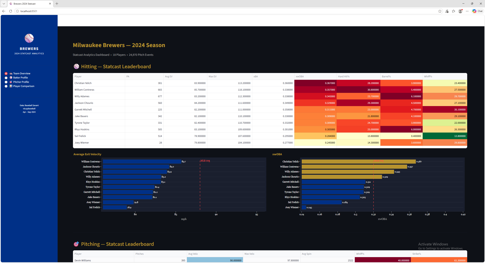
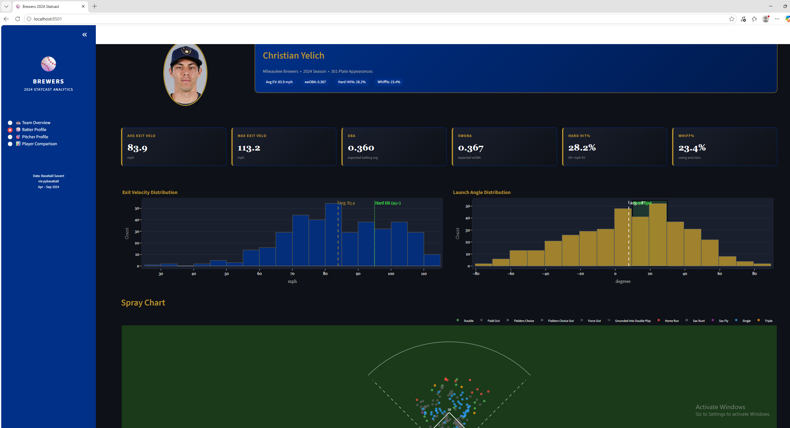
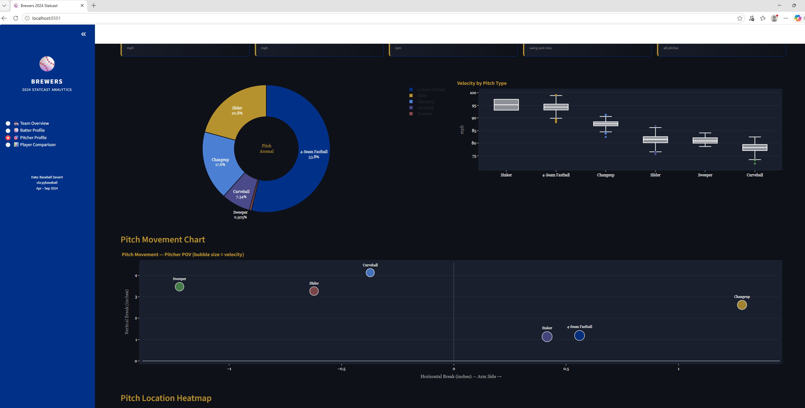
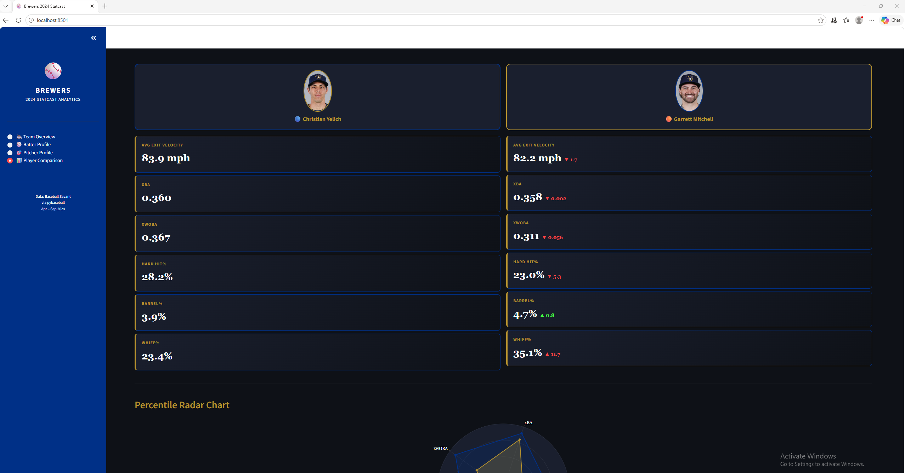

# Milwaukee Brewers 2024 Statcast Analytics Dashboard

An interactive baseball analytics dashboard built on real 2024 MLB Statcast data for the Milwaukee Brewers — demonstrating end-to-end data engineering and visualization skills directly applicable to Baseball Operations analytics roles.

Built with Python, Streamlit, and Plotly using real pitch-level Statcast data from Baseball Savant for 10 Brewers batters and 8 pitchers across the full 2024 regular season.

---

## Dashboard Pages

### 🏟️ Team Overview
- Statcast leaderboard for all Brewers batters sorted by xwOBA
- Exit velocity and xwOBA bar charts with MLB average reference lines
- Pitching leaderboard sorted by whiff rate
- Whiff rate and fastball velocity comparisons across the rotation

### ⚾ Batter Profile
- Player headshot with key Statcast summary tags
- Exit velocity and launch angle distributions with sweet spot overlay
- Interactive spray chart with baseball field outline and batted ball results
- Weekly exit velocity trend with 4-week rolling average

### 🎯 Pitcher Profile
- Player headshot with velocity, whiff rate, and spin rate summary
- Pitch arsenal donut chart
- Velocity box plots by pitch type
- Pitch movement chart — horizontal and vertical break by pitch type
- Pitch location heatmap with strike zone overlay, filterable by pitch type

### 📊 Player Comparison
- Side by side player headshots with stat cards
- Delta indicators showing which player leads each metric
- Percentile radar chart normalized across the Brewers roster
- Exit velocity distribution overlay for batters
- Pitch arsenal comparison for pitchers

---

## Demo






---

## Dataset

- **Source:** Baseball Savant via pybaseball
- **Season:** 2024 MLB Regular Season (April – September)
- **Batters:** Adames, Bauers, Chourio, Contreras, Frelick, Hoskins, Mitchell, Taylor, Wiemer, Yelich
- **Pitchers:** Ashby, Black, Cobb, Megill, Peralta, Quintana, Uribe, Williams
- **Total rows:** 24,970 pitch-level Statcast events
- **Columns:** 119 Statcast fields per pitch including exit velocity, launch angle, spin rate, pitch movement, pitch location, bat speed, and swing metrics

---

## Key Metrics Explained

| Metric | Description |
|---|---|
| **Exit Velocity (EV)** | Speed of ball off bat in mph — higher is better for batters |
| **xBA** | Expected batting average based on exit velocity and launch angle |
| **xwOBA** | Expected weighted on-base average — best single measure of offensive value |
| **Hard Hit%** | Percentage of batted balls with EV ≥ 95 mph |
| **Barrel%** | Percentage of batted balls in the optimal EV + launch angle combination |
| **Whiff%** | Percentage of swings that result in a miss |
| **Spin Rate** | Revolutions per minute of pitched ball — affects movement |
| **H/V Break** | Horizontal and vertical movement of pitched ball in inches |

---

## Tech Stack

- **Data:** pybaseball — Python wrapper for Baseball Savant Statcast API
- **Processing:** Pandas, NumPy
- **Visualization:** Plotly — interactive charts, spray charts, radar charts, heatmaps
- **Dashboard:** Streamlit — multi-page interactive web application
- **Styling:** Custom CSS — dark theme with official Brewers navy and gold color scheme
- **Player photos:** MLB headshot CDN via player MLB IDs

---

## Project Structure

```
mlb-analytics-warehouse/
├── data/
│   ├── all_brewers_batters.csv    # Combined batter Statcast data
│   ├── all_brewers_pitchers.csv   # Combined pitcher Statcast data
│   ├── batters/                   # Individual batter CSV files
│   └── pitchers/                  # Individual pitcher CSV files
├── dashboard/
│   └── app.py                     # Streamlit dashboard application
├── player_ids.py                  # MLB player ID lookup and headshot URLs
├── ingest.py                      # Statcast data ingestion pipeline
├── pull_missing.py                # Script to add missing players
├── screenshots/                   # Dashboard screenshots for README
└── requirements.txt               # Python dependencies
```


---

## Quick Start

```bash
# Clone the repository
git clone https://github.com/PiotrWarchol/mlb-analytics-warehouse.git
cd mlb-analytics-warehouse

# Install dependencies
pip install -r requirements.txt

# Run the dashboard
streamlit run dashboard/app.py

# Open in browser
# http://localhost:8501
```

---

## How It Was Built

### 1. Data Ingestion
Player IDs were resolved using pybaseball's player lookup table against the Baseball Savant database. Statcast pitch-level data was pulled for each player individually across the full 2024 regular season and cached locally to avoid repeated API calls.

### 2. Data Processing
Raw Statcast data contains 119 columns per pitch event. Key metrics were computed from raw fields — hard hit percentage from launch speed thresholds, barrel percentage from the launch speed angle classification, and whiff rate from pitch description codes.

### 3. Dashboard Architecture
The dashboard is structured as a four-page Streamlit application with shared data loading using `@st.cache_data` decorators for performance. All charts use a consistent dark theme with Brewers brand colors applied through custom CSS and a shared layout helper function.

### 4. Player Headshots
MLB headshots are loaded dynamically from the MLB CDN using each player's official MLB ID — the same IDs used by Baseball Savant. Fallback handling ensures the layout remains intact if a headshot fails to load.

---

## Business Context

This dashboard demonstrates the kind of tooling Baseball Systems and R&D teams build internally to support Baseball Operations decision-making:

- **Scouting support** — visualize player tendencies and pitch characteristics
- **Opponent preparation** — analyze pitcher arsenals and location patterns before series
- **Player development** — track exit velocity and launch angle trends across the season
- **Front office analytics** — compare players on expected performance metrics for roster decisions

The natural language query layer built on top of this data in the companion [Baseball RAG Assistant](https://github.com/PiotrWarchol/baseball-rag-assistant) project extends this further — enabling non-technical Baseball Operations staff to query player metrics conversationally without needing SQL or Python knowledge.

---

## Related Projects

- [Baseball RAG Assistant](https://github.com/PiotrWarchol/baseball-rag-assistant) — Production GenAI pipeline with LangChain, ChromaDB, and Azure deployment
- [Manufacturing Defect Detection](https://github.com/PiotrWarchol/defect-detection) — ResNet18 computer vision achieving 99.86% accuracy
- [Predictive Maintenance System](https://github.com/PiotrWarchol/predictive-maintenance) — LSTM neural network achieving 12.99 RMSE on NASA benchmark data
- [Tool Review Sentiment Classifier](https://github.com/PiotrWarchol/tool-sentiment-classifier) — DistilBERT fine-tuning achieving 89.5% accuracy

---

## Author

**Piotr Warchol**
Software Engineer | MS Computer Science — AI Concentration
[GitHub](https://github.com/PiotrWarchol) • [LinkedIn](https://linkedin.com/in/piotrwarchol23)